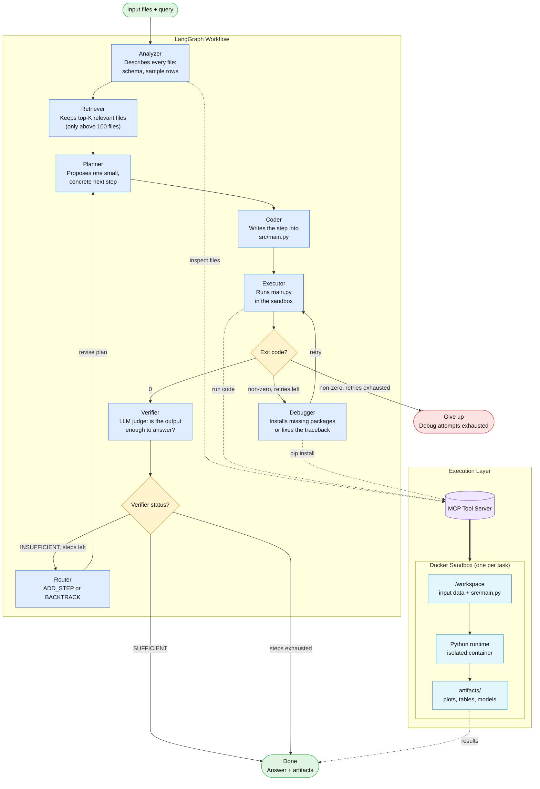

# DataScientistOS

An modified implementation of **DS-STAR** (Nam et al., 2025) — a multi-agent system that
turns a natural-language data question plus a folder of data files into working
code and an answer. This follows DS-STAR's core architecture for well-defined
queries (not the DS-STAR+ extension for open-ended report writing).

## How it works

DS-STAR answers a query about a set of data files by looping through five
agents until an LLM judge decides the current plan and code are sufficient:

## Architecture



**Legend**

| Line style   | Meaning                                        |
| ------------ | ---------------------------------------------- |
| Solid arrow  | Control flow between LangGraph nodes           |
| Dotted arrow | Tool call through the MCP server               |
| Thick arrow  | MCP server executing inside the Docker sandbox |

Solid arrows are the fixed pipeline; the loops are the interesting part: **Coder → Executor → Debugger → Executor**
retries a crashing script, and **Verifier → Router → Planner** is DS-STAR's plan-refinement
loop, which can either add a step or backtrack to redo one that turned out wrong.

Each agent is a small, single-purpose LLM call under `backend/agents/`, wired
together as a LangGraph state machine in `backend/graph/graph.py`. The full
state each agent reads and writes is defined in `backend/graph/state.py`.

- **Analyzer** — generates and runs a small Python script per file to produce
  a text description of its structure and content (works for structured and
  unstructured formats alike).
- **Retriever** — with many input files, embeds the query and each file
  description and keeps only the top-K most relevant ones.
- **Planner** — proposes one small, concrete next step toward answering the
  query, given the plan so far and the last execution output.
- **Coder** — implements the current plan as a single `src/main.py` script.
- **Executor** — runs that script inside the task's Docker sandbox.
- **Debugger** — if the script crashes on a missing package, pip installs it
  via `execute_shell` in the sandbox and just retries. Otherwise it fixes the
  script using the traceback (and the file descriptions, since a traceback
  alone often isn't enough context).
- **Verifier** — an LLM judge that decides whether the plan + code + output
  are actually sufficient to answer the query.
- **Router** — when the verifier says no, decides whether to add a new step
  or backtrack and redo a step that turned out to be wrong.

## Tools

Every tool an agent can call is served by a single MCP server:
`mcp_servers/server.py`. All agents reach it through `backend/mcp_client.py`.

- `write_file` — write a script into the task's workspace.
- `execute_file` — run a script from the workspace inside the task's Docker sandbox.
- `execute_shell` — run any shell command in that same sandbox. The debugger
  uses this to `pip install` a package the moment it sees a
  `ModuleNotFoundError`, rather than asking the LLM to rewrite working code.
  This needs `ALLOW_NETWORK=true` (off by default — see Setup below), since
  the sandbox has no internet access otherwise.

All code the agents write is executed inside a per-task Docker container
(`backend/docker_runner.py`, image built from `docker/Dockerfile.runtime`),
with no network access by default and CPU/memory limits — the host never runs
LLM-generated code directly.

## Setup

Requires Python 3.12, [uv](https://docs.astral.sh/uv/), and Docker Desktop.

```bash
uv sync
cp .env.example .env   # then fill in your OPENAI_API_KEY
```

To trace every agent's LLM calls in [LangSmith](https://smith.langchain.com), uncomment
the `LANGCHAIN_*` lines in `.env` and add your API key -- no code changes needed.

Build the sandbox image the executor runs code in:

```bash
docker build -t datasci-runtime:latest -f docker/Dockerfile.runtime docker
```

Start the MCP tool server (keep this running in its own terminal):

```bash
uv run python -m mcp_servers.server
```

## Running a task

From the command line, everything is printed live as the agent works:

```bash
uv run python scripts/run_task.py "train a model to predict Outcome" samples/data.csv
```

Or over HTTP, via the FastAPI wrapper:

```bash
uv run uvicorn backend.api.main:app --reload
```

```bash
curl -X POST http://127.0.0.1:8000/tasks \
  -F "prompt=train a model to predict Outcome" \
  -F "files=@samples/data.csv"
# then: GET /tasks/{task_id}, /tasks/{task_id}/logs, /tasks/{task_id}/result
```

Each task gets its own folder under `storage/tasks/<task_id>/workspace/`
(`input/` for uploaded files, `src/main.py` for the current solution, plus
whatever the code itself produces) and its own Docker container for the
duration of the run -- the container is torn down as soon as the task
finishes, whether it succeeded or failed, so none are left orphaned. The
final graph state also lands in `workspace/state/state.json`.

## Benchmark suite

`scripts/make_sample.py` generates ten synthetic datasets under `samples/`,
five of them paired with prompts in `scripts/run_task.py` that progressively
exercise EDA, ML classification, forecasting, hypothesis testing, and
multi-file root-cause analysis:

```bash
uv run python scripts/make_sample.py     # generates samples/*.csv
uv run python scripts/run_task.py --benchmark        # all 5, in order
uv run python scripts/run_task.py --benchmark 2      # just task 2 (churn ML)
```

Tasks 2 (churn ML) and 5 (multi-file root-cause analysis) are the most useful
for exercising the debugger and the planner/router loop, since they're the
least likely to succeed on the very first generated script.

## Layout

```
backend/
  agents/        one file per DS-STAR agent
  graph/         the LangGraph state machine wiring the agents together
  api/           FastAPI wrapper (optional HTTP interface)
  config.py      every tunable in one place (model names, limits, ports)
  llm.py         picks which model backs each agent role
  schemas.py     structured-output types for the planner/verifier/router
  mcp_client.py  talks to the MCP tool server
  docker_runner.py  starts/runs commands in each task's sandbox container
  workspace.py   creates a task's folder layout, copies input files in
  runner.py      runs the graph end to end, printing every step
mcp_servers/
  server.py      the single MCP server: write_file, execute_file
docker/
  Dockerfile.runtime        the sandbox image code executes in
  requirements-runtime.txt  its Python packages
scripts/
  run_task.py    CLI entry point
  make_sample.py regenerates samples/data.csv
```
