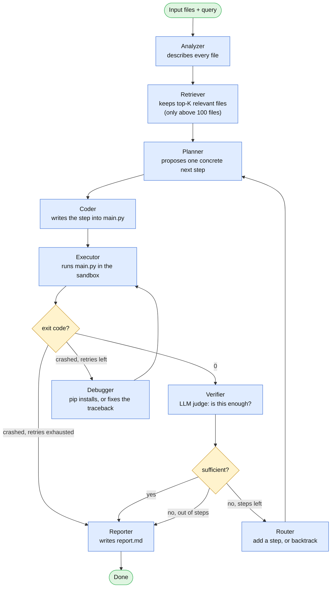

# DataScientistOS

A multi-agent system that turns a natural-language data question plus a folder
of data files into working code and an answer. Point it at a `.csv`, a pile of
mixed CSV/JSON/text files, or anything in between, describe what you want
("clean this and plot revenue by month", "train a model to predict churn"),
and it plans, writes, runs, and debugs its own code in a sandboxed
container until an LLM judge is satisfied — then writes up what it found.

## Inspired by DS-STAR

The agent loop is based on **DS-STAR** (Nam et al., 2025 — Google Cloud &
KAIST, [arXiv:2509.21825](https://arxiv.org/abs/2509.21825)): analyze every
file first, then loop through *plan → code → execute → verify*, letting an
LLM judge (not just "did it crash") decide when the answer is actually done,
and letting a router either add the next step or backtrack and redo one that
turned out wrong. This project implements that core loop for well-defined
queries — not DS-STAR+, the paper's separate extension for open-ended report
writing.

**What's different from the paper:**

- **Always reports.** The paper's well-defined-query loop stops at code + a
  short answer; DS-STAR+'s report writer is a separate, open-ended-query
  system. Here, a **Reporter** agent always runs last regardless — writing
  `report.md` with the answer, the steps taken, and the files produced, or a
  plain explanation of what went wrong if the run gave up.
- **Faster debugging.** The paper's debugger always asks an LLM to rewrite
  the script from the traceback. Here, a missing-package crash
  (`ModuleNotFoundError`) is fixed by just `pip install`-ing it and retrying
  — no LLM call needed for the most common failure.
- **Per-agent models, not one frontier model.** The paper runs every agent on
  a single model (Gemini-2.5-Pro in their main results). Here, each agent's
  model is chosen independently (GPT-4o for the ones that need to reason
  hardest — planner, verifier, debugger; GPT-4o-mini for the rest) and is
  configurable per-role via `.env`.
- **No finalizer agent.** The paper has a separate agent that applies
  output-formatting rules to the final script; this is folded into the
  Reporter instead.
- **Different embedding model** for the retriever (OpenAI
  `text-embedding-3-small` instead of the paper's Gemini-Embedding-001) —
  same mechanism and thresholds otherwise (only kicks in above 100 files,
  keeps the top 100).
- **The productization layer is new**, since the paper describes only the
  agent algorithm: LangGraph as the concrete orchestration framework, a
  locked-down per-task Docker sandbox with no network access by default, an
  MCP tool server as the only way agents touch that sandbox, a FastAPI +
  React app with a live pipeline visualization, and optional LangSmith
  tracing for per-task token/cost accounting.

## Architecture



Solid arrows are the fixed pipeline; the two loops are the interesting part —
**Coder → Executor → Debugger → Executor** retries a crashing script (up to
`MAX_DEBUG_ATTEMPTS`), and **Verifier → Router → Planner** is the
plan-refinement loop, which either adds a step or backtracks to redo one that
turned out wrong (up to `MAX_STEPS` rounds total). However the run ends, the
Reporter always runs once at the end.

Each agent is a small, single-purpose LLM call under `backend/agents/`, wired
together as a LangGraph state machine in `backend/graph/graph.py`. All code
the agents write is executed inside a per-task Docker container
(`backend/docker_runner.py`) with no network access and CPU/memory limits by
default — the host never runs LLM-generated code directly. Every tool an
agent can call (`write_file`, `execute_file`, `execute_shell`) is served by a
single MCP server (`mcp_servers/server.py`).

## Running it

Requires Python 3.12, [uv](https://docs.astral.sh/uv/), and Docker Desktop.

```bash
uv sync
cp .env.example .env      # fill in OPENAI_API_KEY

docker build -t datasci-runtime:latest -f docker/Dockerfile.runtime docker

uv run python -m mcp_servers.server    # keep running in its own terminal
```

Then, from the command line:

```bash
uv run python scripts/run_task.py "train a model to predict Outcome" samples/data.csv
```

Or over HTTP, with the React UI:

```bash
uv run uvicorn backend.api.main:app --reload   # in one terminal

cd frontend && npm install && npm run dev      # in another
```

The UI lets you upload files, type a prompt, watch the pipeline diagram
light up as each agent runs, and download the report and any files created
when it's done. Each task gets its own folder under
`storage/tasks/<task_id>/workspace/` and its own Docker container, torn down
as soon as the task finishes.

## Layout

```
backend/
  agents/        one file per DS-STAR agent
  graph/         the LangGraph state machine wiring the agents together
  api/           FastAPI wrapper
  config.py      every tunable in one place
  llm.py         picks which model backs each agent role
  docker_runner.py  starts/runs commands in each task's sandbox container
mcp_servers/
  server.py      the single MCP server: write_file, execute_file, execute_shell
docker/          the sandbox image code executes in
scripts/         CLI entry point + sample data generator
frontend/        the React UI: upload form, pipeline diagram, logs, report
```
